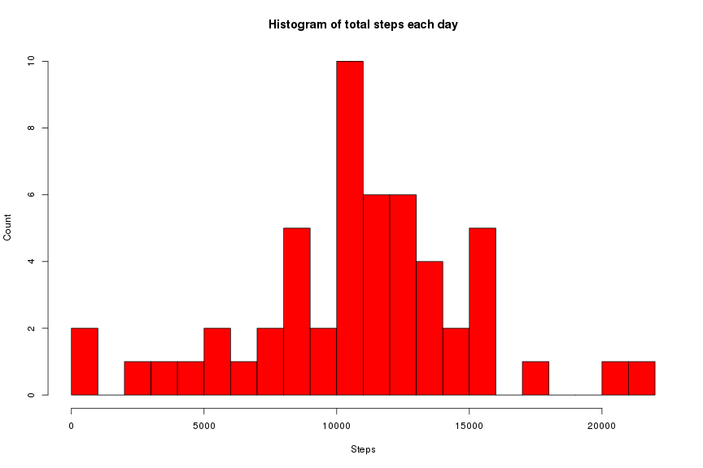
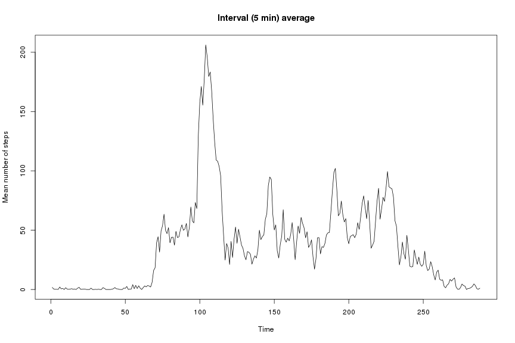
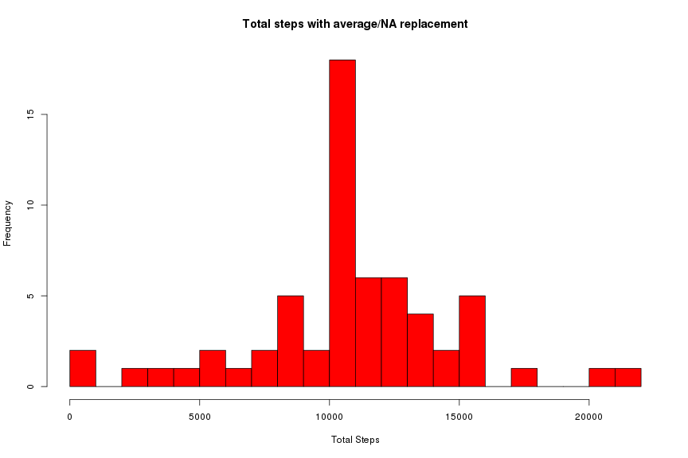
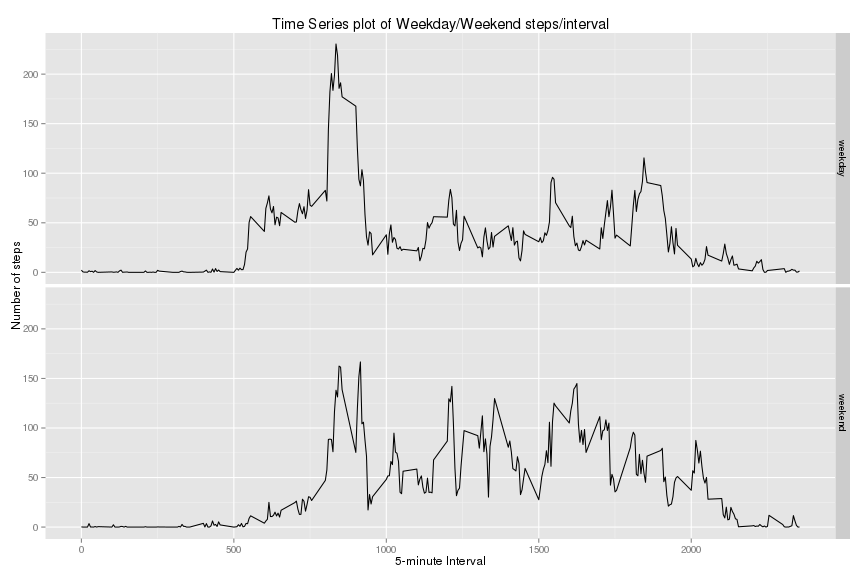

Reproducible Research - Peer Reviewed Project 1
-----------------------------------------------

# Synopsis
The goal of this assignment is to create a report that answers a list of predefined questions (list below). The report needs to be contain a single R markdown document (this document) that can be processed by knitr and transformed into an HTML file. 

# Assignment Details

This assignment makes use of data from a personal activity monitoring device. The data consists of two months of data from an anonymous individual collected during the months of October and November, 2012 and include the number of steps taken in 5 minute intervals each day.


# Data

Before trying to answer the questions the first step in this project is to unzip the raw data file, load the libraries and then the data. The following code assumes you have the data file activity.zip uncompressed and in the current working directory. The raw data was forked August 7th, 2015 from github and can be found in the file [activity.zip](https://github.com/sfavorite/RepData_PeerAssessment1). 

The data will be unziped using the R function unzip (OS/R version listed below).


```r
knitr::opts_chunk$set(fig.width=12, fig.height=8, echo=TRUE)
library(dplyr)
```

```
## 
## Attaching package: 'dplyr'
## 
## The following objects are masked from 'package:stats':
## 
##     filter, lag
## 
## The following objects are masked from 'package:base':
## 
##     intersect, setdiff, setequal, union
```

```r
library(ggplot2)
library(timeDate)
unzip("activity.zip")
data <- read.csv("activity.csv", header=TRUE)
```

There are 3 variables included in this dataset (missing data is coded as NA):

* steps: Number of steps taking in a 5-minute interval (missing values are coded as NA)
* date: The date on which the measurement was taken in YYYY-MM-DD format
* interval: Identifier for the 5-minute interval in which measurement was taken

The dataset is stored in a comma-separated-value (CSV) file and there are a total of 17,568 observations. The first six observations are:

```r
# Show the first six observations
head(data)
```

```
##   steps       date interval
## 1    NA 2012-10-01        0
## 2    NA 2012-10-01        5
## 3    NA 2012-10-01       10
## 4    NA 2012-10-01       15
## 5    NA 2012-10-01       20
## 6    NA 2012-10-01       25
```

## What is mean total number of steps taken per day?
This question is answered ignoring any missing values. The steps taken for question 1 are:

1 Calculate the total number of steps taken per day

2 Make a histogram of the total number of steps taken each day

3 Calculate and report the mean and median of the total number of steps taken per day


```r
# Total steps taken per day 
sum_per_day <- aggregate(steps~date, data=data, FUN=sum)
# Histogram of the steps per day
hist(sum_per_day$steps, breaks=20, col="red", main="Histogram of total steps each day", xlab="Steps", ylab="Count")
```

 

The median and mean steps taken per day.

```r
# Mean  & median of  the total number of steps taken
steps_median <- median(sum_per_day$steps)
cat("Median (steps/day) = ", steps_median)
```

```
## Median (steps/day) =  10765
```

```r
steps_mean<-mean(sum_per_day$steps)
cat("Mean (steps/day) = ", steps_mean)
```

```
## Mean (steps/day) =  10766.19
```

## What is the average daily activity pattern?

1 Make a time series plot of the 5-minute intervals and the average number of steps taken, averaged across all days. 

2 Which 5-minute interval, on average across all the days in the dataset, contains the maximum number of steps?

We will first take the aggregate average (mean) of the steps taken relative to the 5-minute time interval and then produce the time series plot. The maximum number of steps taken ignoring missing values (NA).

```r
# Total steps in 5-minute intervals
interval_total <- aggregate(steps~interval, data=data, FUN=mean)
plot(ts(interval_total$steps), ylab="Mean number of steps", main="Interval (5 min) average")
```

 

Which interval contains the maximum number of steps?

```r
interval_total[which.max(interval_total$steps), ]
```

```
##     interval    steps
## 104      835 206.1698
```

## Imputing missing values

### Goal and Strategy 
There are a number of days/intervals where there are missing values (coded as NA). The presence of missing days may introduce bias into some calculations or summaries of the data. The goal of this step is to devise a strategy for filling in all of the missing values in the dataset. My strategy for filling in the missing data is to take the the mean for each 5-minute interval, create a second dataset (data2) that is equal to the first dataset but with the missing data filled in using the mean/interval.

The steps are:

1 Calculate and report the total number of missing values in the dataset (i.e. the total number of rows with NAs)

2 Devise a strategy for filling in all of the missing values in the dataset. 

3 Create a new dataset that is equal to the original dataset but with the missing data filled in.

4 Make a histogram of the total number of steps taken each day and calculate and report the mean and median total number of steps taken per day. Do these values differ from the estimates from the first part of the assignment? What is the impact of imputing missing data on the estimates of the total daily number of steps?

Do these values differ from the estimates from the first part of the assignment? What is the impact of imputing missing data on the estimates of the total daily number of steps?


```r
# Imputing Missing values
# Number of missing values
cat("Total missing values: ",sum(is.na(data$steps)))
```

```
## Total missing values:  2304
```

We now use the subsitution strategy outlined above to fill in missing data. 


```r
# Compute the mean/interval average and create a second (equal) dataset with the missing values replaced. 
data2 <- data  %>% group_by(interval) %>% mutate(steps=replace(steps, is.na(steps), mean(steps, na.rm=TRUE))) %>% data.frame()
# Compute the total number of steps taken each day.
filled_in <- aggregate(steps~date, data=data2, FUN=sum)
```

The histogram of the total number of steps taken each day with the new dataset (NA's replaced).

```r
# Histogram of the total number of steps taken each day
hist(filled_in$steps, breaks=20, col="red", main="Total steps with average/NA replacement", xlab="Total Steps")
```

 
The impact of imputing the missing data using the mean/interval strategy has only a minor (1.19) increase in the reported median and no change in the reported mean. 

```r
filled_in_steps_median <- median(filled_in$steps)
filled_insteps_mean<-mean(filled_in$steps)
cat("Median steps/day: ", median(filled_in$steps))
```

```
## Median steps/day:  10766.19
```

```r
cat("Mean steps/day: ", mean(filled_in$steps))
```

```
## Mean steps/day:  10766.19
```

```r
cat("Original median: ", steps_median, " mean: ", steps_mean)
```

```
## Original median:  10765  mean:  10766.19
```

## Are there differences in activity patterns between weekdays and weekends?

We will use the new dataset (filled in NA's) and create a new factor variable in the dataset with two levels – “weekday” and “weekend” indicating whether a given date is a weekday or weekend day. Once done a panel plot containing a time series plot (i.e. type = “l”) of the 5-minute interval (x-axis) and the average number of steps taken, averaged across all weekday days or weekend days (y-axis). 


```r
data2 <- data2 %>% mutate(wd=ifelse(isWeekday(x=data2$date), "weekday", "weekend")) %>% data.frame()
filled_in_total <- aggregate(steps~interval + wd, data=data2, FUN=mean)
ggplot(filled_in_total, aes(x=interval, y=steps)) + geom_line(nrow=2, ncol=0) + facet_grid(wd ~ .) + xlab("5-minute Interval") + ylab("Number of steps") + ggtitle("Time Series plot of Weekday/Weekend steps/interval")
```

 

# Environment Information


```r
version
```

```
##                _                           
## platform       x86_64-pc-linux-gnu         
## arch           x86_64                      
## os             linux-gnu                   
## system         x86_64, linux-gnu           
## status                                     
## major          3                           
## minor          2.2                         
## year           2015                        
## month          08                          
## day            14                          
## svn rev        69053                       
## language       R                           
## version.string R version 3.2.2 (2015-08-14)
## nickname       Fire Safety
```
